<div align="center">
  <a href="https://jay-patel1337-six.vercel.app/play"></a>
  
</div>


```cpp
// about_me.cpp  (it compiles: g++ -std=c++17 about_me.cpp)
#include <iostream>
#include <string>
#include <vector>

enum Month { Jan = 1, Feb, March, Apr, May, Jun, Jul, Aug, Sep, Oct, Nov, Dec };

struct Birthday {
  int day;
  Month month;
};

class JayPatel {
 public:
  std::string role  = "Computer Engineering @ Silver Oak University";
  std::string motto = "I'll wait where the stars forget to shine.";

  std::vector<std::string> languages = {"C", "C++", "Python", "HTML", "CSS"};
  std::vector<std::string> tools     = {"Git", "GitHub", "VS Code", "Flask"};

  std::string currentQuest = "Data Structures & Algorithms";
  std::string sideQuest    = "Ship more web apps";

  std::vector<std::string> watchlist = {"Bleach", "Another", "Erased"};
  Birthday birthday{0b1101, March};  // wish me on this day ;)

  void greet() const {
    std::cout << "Hello, World! Thanks for dropping by.\n";
  }
};

int main() {
  JayPatel().greet();
}
```


<p align="center">
  <a href="https://github.com/jay-patel1337/C_self"></a>
  <a href="https://github.com/jay-patel1337/CPP_self"></a>
  <a href="https://github.com/jay-patel1337/codealpha_tasks"></a>
  <a href="https://github.com/jay-patel1337/FoodiePieUp"></a>
</p>


<a href="https://jay-patel1337-six.vercel.app/api/now-playing?open"></a>

<a href="https://jay-patel1337-six.vercel.app/play"></a>
<a href="https://jay-patel1337-six.vercel.app/play"></a>

<picture>
  <source media="(prefers-color-scheme: dark)" srcset="https://raw.githubusercontent.com/jay-patel1337/jay-patel1337/output/snake-dark.svg">
  
</picture>

<details>
<summary><b>📜 LORE: anime ball knowledge (spoiler-free)</b></summary>
<br>

**⚔️ BLEACH**
- 366 episodes from 2004 to 2012 by Studio Pierrot, then back from the dead with *Thousand-Year Blood War* in 2022.
- The very first opening, "\*\~Asterisk\~", is by ORANGE RANGE.
- Shirō Sagisu (yes, the *Evangelion* composer) scored it. By his own account, "Number One" became the face of Bleach.
- Aizen's Kyōka Suigetsu puts anyone who has seen its release under complete hypnosis. That is where the meme comes from.

**⏳ ERASED**
- The Japanese title, *Boku dake ga Inai Machi*, means "The Town Where Only I Am Missing".
- Satoru is a 29-year-old manga artist delivering pizza, and his "Revival" throws him back to 1988.
- The opening "Re:Re:" by ASIAN KUNG-FU GENERATION first came out in 2004 on *Sol-fa*, and was re-recorded for the anime in 2016.

**👁️ ANOTHER**
- A 2012 P.A. Works anime based on Yukito Ayatsuji's novel.
- Set in 1998 in class 3-3 of Yomiyama North Middle School, where one rule matters: pretend one classmate doesn't exist.
- Its only opening is "Kyōmu Densen" (*Nightmare Contagion*) by ALI PROJECT.

**🧪 Parody corner** (not real quotes)
> *"Since when were you under the impression that my code had no bugs?"*: Aizen, reviewing my PR
>
> *"Bankai: `git push --force`"*
>
> Revival: when <kbd>Ctrl</kbd>+<kbd>Z</kbd> works on real life.
>
> Class 3-3 rule: pretend one compiler warning doesn't exist.
>
> Kayo, reading my first C program: *"Are you stupid?"*

</details>

<details>
<summary><b>🛠️ UNDER THE HOOD: how this profile is built</b></summary>
<br>

No templates or card services. Everything here is generated by code in this repo:

- **Pixel font engine**: a hand-made 5×7 bitmap font ([`scripts/lib/pixel-font.js`](scripts/lib/pixel-font.js)) turns text into SVG paths, so it stays crisp without web fonts (GitHub won't let SVGs load them).
- **Renderer**: [`scripts/render.js`](scripts/render.js) draws every panel, sprite and animation as SVG. Animations are CSS keyframes with `steps()` timing for that choppy 8-bit feel, and each one falls back to its final frame under `prefers-reduced-motion`.
- **Single config**: all of the content lives in [`profile.config.js`](profile.config.js). Running `npm run assets` rebuilds everything, with zero dependencies.
- **Live data**: a [GitHub Action](.github/workflows/daily.yml) runs every 6 hours. It pulls stats through the GraphQL API, recomputes the HUD, language XP, streaks and trophy unlocks, rotates the quote of the day, and regenerates the snake.
- **Hollow Rush** ([play it](https://jay-patel1337-six.vercel.app/play) · [`play/`](play/)): a canvas game at 320×180 with fixed-timestep physics, a double-jump "Shunpo", procedurally generated Karakura rooftops, Hollows with simple AI, combos, a Hollow-mask power-up, hit-stop and screen shake. Its chiptune music and sound effects are synthesized live with WebAudio. The hero is composed from layered sprite parts ([`scripts/lib/ichigo.js`](scripts/lib/ichigo.js)), and the same frames animate this README.
- **Now playing**: a Vercel serverless function ([`api/now-playing.js`](api/now-playing.js)) asks the Spotify Web API what's playing and draws it in the same pixel style, with a pixelated album cover inlined as base64.

</details>

<p align="center">
  <a href="https://www.linkedin.com/in/jay-patel-027200377"></a>
  <a href="https://www.instagram.com/jayx_xpatel"></a>
  <a href="mailto:jaypatel2007.bp@gmail.com"></a>
</p>


<p align="center">
  <a href="https://github.com/jay-patel1337/jay-patel1337/actions/workflows/daily.yml"></a>
</p>
